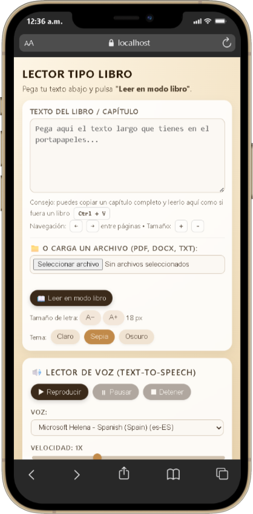
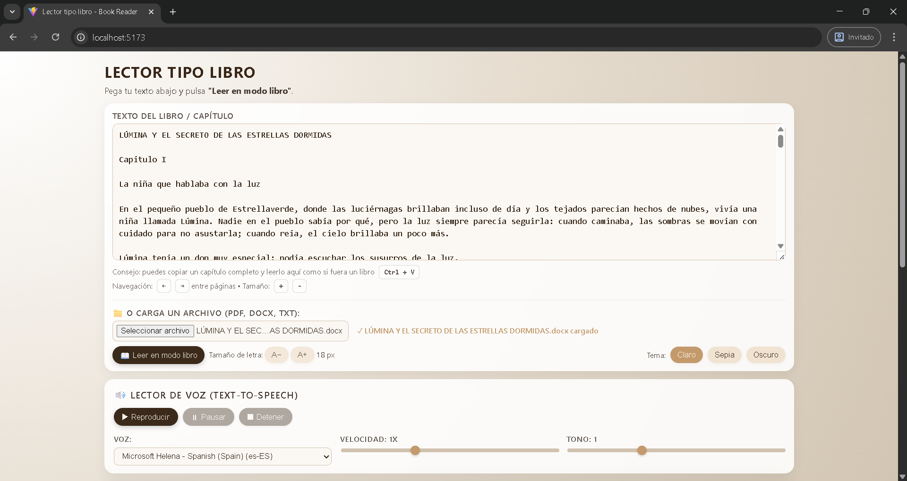
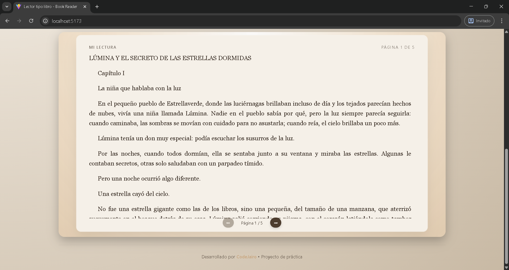

# 📖 Book Reader - Lector Tipo Libro

Un lector web elegante que transforma textos largos en una experiencia de lectura tipo libro, con paginación automática, múltiples temas visuales, carga de archivos y lectura por voz.

## 🎯 Características

### 📚 Lectura y Visualización

- **Formato de libro**: Texto justificado con columnas automáticas (dos columnas en pantallas grandes)
- **Paginación inteligente**: Sistema de paginación que se adapta al contenido
- **Temas visuales**: Tres temas disponibles (Claro, Sepia, Oscuro)
- **Tipografía ajustable**: Controles para aumentar/reducir el tamaño de letra
- **Animaciones suaves**: Efecto de paso de página al navegar
- **Responsive**: Diseño adaptable a diferentes tamaños de pantalla

### 📁 Carga de Archivos

- **Múltiples formatos**: Soporta PDF, Word (.docx) y archivos de texto (.txt)
- **Extracción automática**: El texto se extrae y se inserta automáticamente en el editor
- **Interfaz simple**: Solo arrastra o selecciona tu archivo

### 🔊 Text-to-Speech (Lector de Voz)

- **Lectura de texto**: Escucha tu texto leído en voz alta
- **Controles completos**:
  - ▶ Reproducir/Reanudar
  - ⏸ Pausar
  - ⏹ Detener
- **Personalización de voz**:
  - Selector de voz (múltiples idiomas y voces disponibles)
  - Control de velocidad (0.5x - 2x)
  - Control de tono (0.5 - 2)

## 📸 Capturas de Pantalla

### Vista Principal



### Carga de Archivos



### Paginación en Acción



## 🚀 Uso

### Lectura Básica

1. Pega tu texto en el área de texto o carga un archivo (PDF, DOCX, TXT)
2. Haz clic en "📖 Leer en modo libro"
3. Usa los controles para ajustar el tamaño de letra
4. Navega entre páginas con las flechas o las teclas ← →
5. Cambia el tema según tu preferencia

### Carga de Archivos

1. Haz clic en "📁 O carga un archivo (PDF, DOCX, TXT)"
2. Selecciona tu archivo desde el explorador
3. El texto se extraerá automáticamente y aparecerá en el área de texto
4. Haz clic en "📖 Leer en modo libro" para comenzar a leer

### Text-to-Speech

1. Asegúrate de tener texto en el área de texto
2. Selecciona tu voz preferida en el selector "Voz" (si hay voces disponibles en tu navegador)
3. Ajusta la velocidad y el tono según tu preferencia **antes de iniciar la reproducción**
4. Haz clic en "▶ Reproducir" para comenzar la lectura
5. Usa "⏸ Pausar" para pausar temporalmente
6. Usa "⏹ Detener" para detener completamente la lectura

**Nota:** Los controles de velocidad, tono y voz se deshabilitarán durante la reproducción. Detén la lectura para modificarlos.

## 🛠️ Tecnologías

- HTML5
- CSS3 (con CSS Variables y animaciones)
- JavaScript Vanilla (ES6+)
- Vite (build tool)

## 📦 Instalación y Desarrollo

```bash
# Instalar dependencias
npm install

# Iniciar servidor de desarrollo
npm run dev

# Construir para producción
npm run build
```

## 📝 Estructura del Proyecto

```
book-reader/
├── src/
│   ├── main.js          # Lógica principal y orquestación
│   ├── fileUpload.js    # Módulo de carga y extracción de archivos
│   ├── textToSpeech.js  # Módulo de text-to-speech
│   └── style.css        # Estilos globales
├── public/
│   └── app.html         # Contenido de la aplicación
├── index.html           # Punto de entrada
└── package.json         # Dependencias
```

## 📦 Formatos Soportados

### Archivos de Entrada

- **PDF** (.pdf): Extrae texto de documentos PDF
- **Word** (.docx): Extrae texto de documentos de Microsoft Word
- **Texto plano** (.txt): Lee archivos de texto plano

### Text-to-Speech

- Utiliza la API Web Speech Synthesis del navegador
- Soporta múltiples voces e idiomas (dependiendo del navegador y sistema operativo)
- Español priorizado cuando está disponible
- **Nota:** Algunos navegadores pueden no tener voces disponibles. Se recomienda usar Chrome o Edge para mejor compatibilidad.

## 🎨 Temas

- **Claro**: Fondo beige claro, ideal para lectura diurna
- **Sepia**: Tono cálido tipo papel antiguo, reduce fatiga visual
- **Oscuro**: Fondo oscuro para lectura nocturna

## ❓ Solución de Problemas

### El selector de voces está vacío

- **Causa:** Tu navegador o sistema operativo no tiene voces TTS instaladas
- **Solución:**
  - Usa Chrome, Edge o Safari que generalmente incluyen voces
  - En Windows, instala voces adicionales desde Configuración > Hora e idioma > Voz
  - En macOS, las voces están disponibles por defecto
  - En Linux, instala paquetes de síntesis de voz como `espeak`

### La paginación no funciona correctamente

- **Causa:** El contenido es muy corto o la ventana es muy grande
- **Solución:**
  - Agrega más texto para generar múltiples páginas
  - Reduce el tamaño de la ventana del navegador
  - Aumenta el tamaño de la fuente con los botones A+ y A-

### Los controles de velocidad y tono no responden

- **Causa:** Están deshabilitados durante la reproducción
- **Solución:** Detén la reproducción con el botón "⏹ Detener", ajusta los valores, y vuelve a reproducir

## 👨‍💻 Desarrollador

**CodeJairo**

Este es un proyecto de práctica para explorar técnicas de diseño web y manipulación del DOM con JavaScript Vanilla.

## 📄 Licencia

Proyecto personal de práctica - Uso libre para aprendizaje
